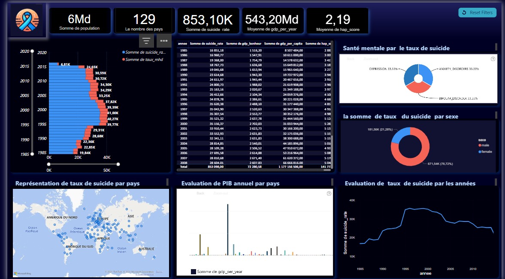
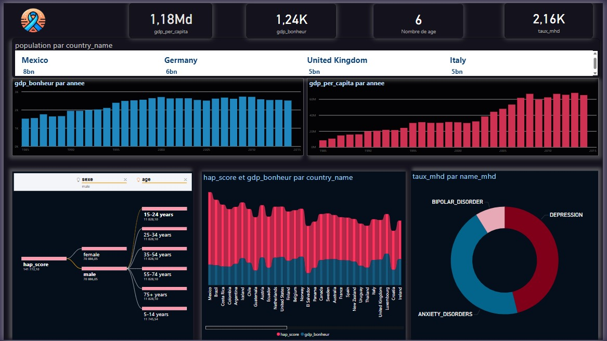

# Suicide_Analysis_Dashboard_powerBI

## Overview

This project focuses on analyzing global suicide data using **Talend** for ETL processes and **Power BI** for interactive visualizations. The goal is to provide a data-driven insight into suicide rates, exploring key factors such as mental health disorders, happiness indicators, and demographics. The project uses a Data Warehouse (DW) architecture to centralize and structure the data for better analysis.

## Features

- **Data Integration:** Uses Talend for extracting, transforming, and loading (ETL) various datasets on mental health, happiness, and demographic factors.
- **Interactive Dashboard:** Built using Power BI to visualize and explore trends in suicide rates, along with correlations between various socio-economic and mental health indicators.
- **Data Warehouse:** A robust DW design that stores and organizes data for efficient querying and analysis.
- **Global Insights:** Provides insights into global suicide trends and factors contributing to suicide, such as GDP, happiness scores, mental health disorders, and demographic details like age and gender.

## Technologies Used

- **Talend:** ETL tool used for data integration and preparation.
- **Power BI:** Data visualization tool used for creating interactive dashboards and reports.
- **Data Warehouse:** For storing and structuring data from various sources (CSV, Excel, JSON).

## Getting Started

### Prerequisites

- **Talend Open Studio** for data integration and ETL processes.
- **Power BI Desktop** to view and interact with the dashboard.
- GitHub account to access and clone the repository.
---

### Installation

1. **Clone the repository:**

   ```bash
   git clone https://github.com/username/Suicide_Analysis_Dashboard_powerBI.git

2.  **Set up Talend**

**Install Talend Open Studio:**
   - Download **Talend Open Studio** from the [official Talend website](https://www.talend.com/download/).
   - Install Talend Open Studio on your machine by following the installation instructions provided on the website.

 **Create a New Talend Project:**
   - Open **Talend Open Studio** after installation.
   - Click on **Create a new project** and give your project a name (e.g., "Suicide Data Analysis").
   - Select **Finish** to create your new project.

**Import Data Sources:**
   - After creating the project, you need to import the data sources for the project. These can include:
     - **CSV Files** (e.g., suicide statistics data).
     - **Excel Files** (e.g., mental health statistics).
     - **JSON Files** (e.g., happiness index data).
   - Go to the **Repository** pane, right-click on **Metadata**, and select **Create file connection**. Select the format (CSV, Excel, or JSON) and configure the connections to your data sources.

 **Set Up Your ETL (Extract, Transform, Load) Process:**
   - **Extract:** Use the Talend components to connect and extract data from the various data sources (CSV, Excel, JSON).
   - **Transform:** Apply necessary transformations to the data to make it consistent, clean, and suitable for analysis (e.g., data cleaning, standardization, aggregation).
   - **Load:** Load the transformed data into your **Data Warehouse** or target system (e.g., MySQL, PostgreSQL).
   - You can use Talend’s drag-and-drop components to build your ETL jobs for each part of the process.


3. **Power BI Setup**

**Install Power BI Desktop:**
   - Download and install **Power BI Desktop** from [Power BI’s official website](https://powerbi.microsoft.com/downloads/).

**Open the Power BI File (.pbix):**
   - Open the Power BI report file (`.pbix`) in Power BI Desktop.
   - Connect the report to your **Data Warehouse** or the processed data from Talend.
   - Customize and explore the visualizations provided in the dashboard to analyze trends related to suicides.

---

## Usage

- Open the Power BI report to view the **Suicide Analysis Dashboard**.
- Use the interactive filters to explore different factors, such as:
  - Country
  - Year
  - Age group
  - Gender
- Analyze trends over time and identify key correlations with mental health, happiness scores, and socio-economic indicators.

---

## Dashboard Screenshots

Here are some screenshots of the dashboard for better understanding:

- **Global Suicide Rate Analysis**


  

  

- **Correlation between Mental Health and Suicide Rates**

  
    


---

## Contributing

If you'd like to contribute to this project, feel free to fork the repository, submit issues, and create pull requests. Contributions to improve data processing, visualization, and overall project functionality are welcome!

---

## License

This project is licensed under the MIT License – see the [LICENSE](LICENSE) file for details.

